# **kidsbits Blocks Coding Piranha LED Flicker Module**

**(Black and Eco-friendly)**

**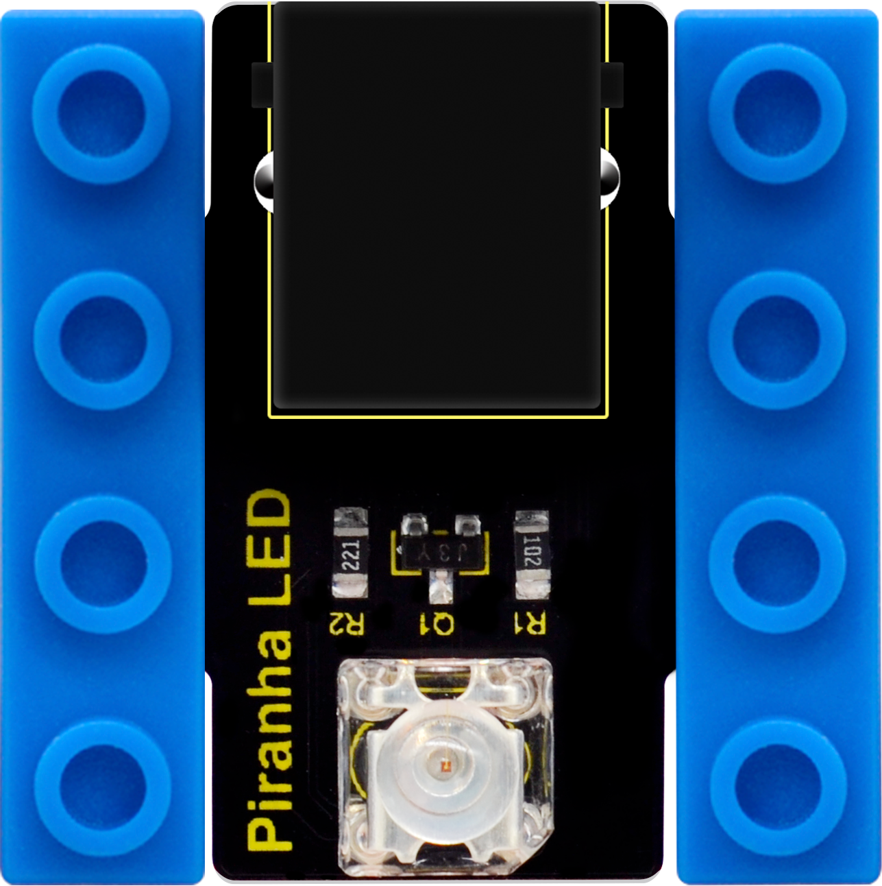**

## Description

kidsbits blocks coding Piranha LED module is fully compatible with kidsbits
control board and Lego building blocks.

You can easily connect it to kidsbits control board for communication using an
RJ11 cable without worrying about wrong wiring and damage.

The LED module mainly consists of a Piranha LED, which will emit red light.

When using, should connect the LED module to Digital interface. If set the
Digital interface to HIGH, LED will light; if set to LOW level, LED will turn
off.

To get more use details, see the instructions below to get started with Mixly
coding.

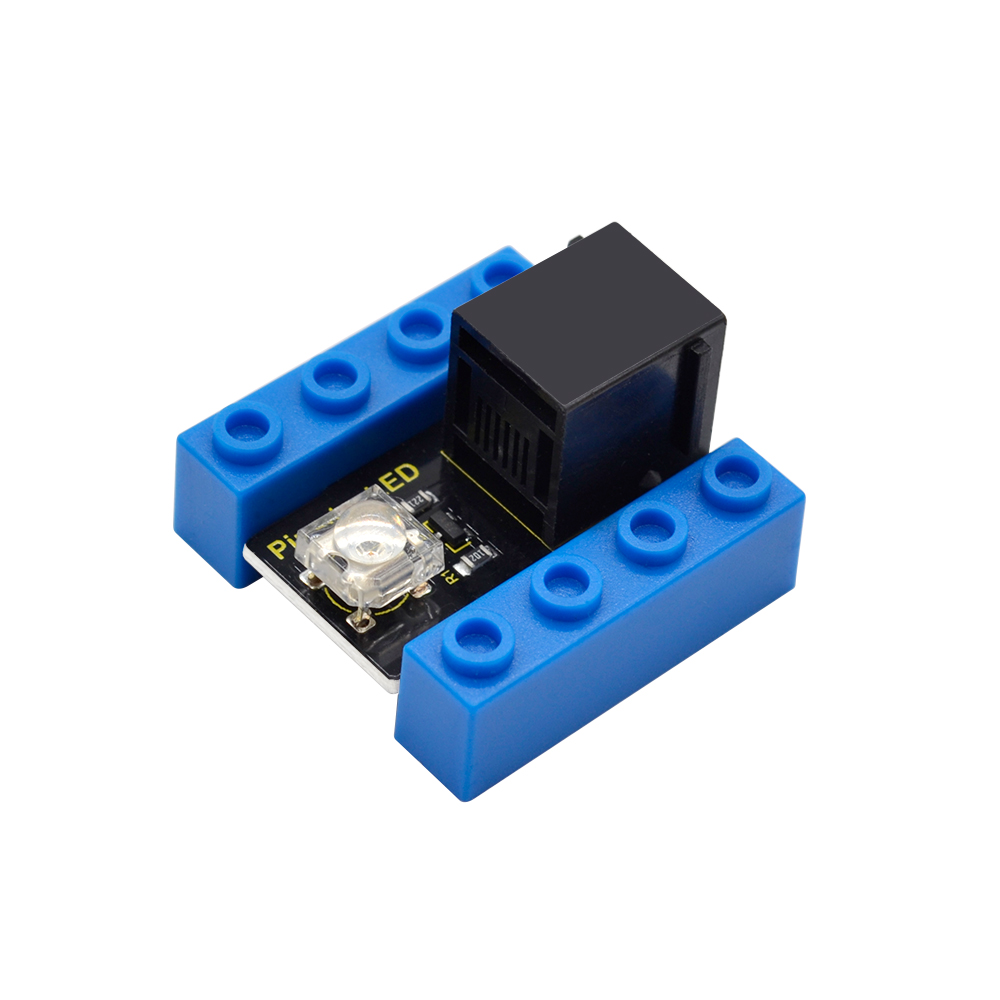

## Technical Parameters

-   Interface: Digital

-   Operating voltage: DC 5V

-   Luminous color: red

## Hookup Guide

## Import kidsbits Library

Begin with the Mixly blocks coding, you should first import the corresponding
kidsbits library for those sensor modules.

Connect the control board to your computer using a USB cable.

Then open the Mixly blocks software 0.998, set the board to UNO R3, select your
correct COM port. On the upper right corner you can switch the language.

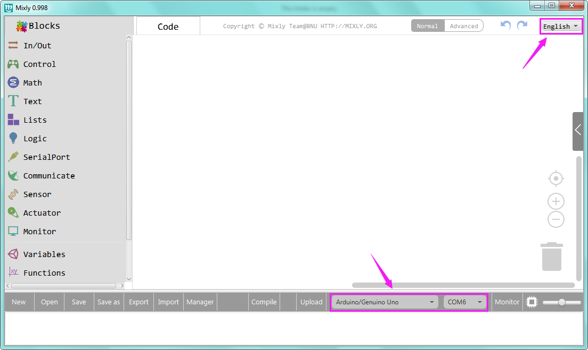

After that, click **Import**, import the keyes-kidsbits library. Shown below.

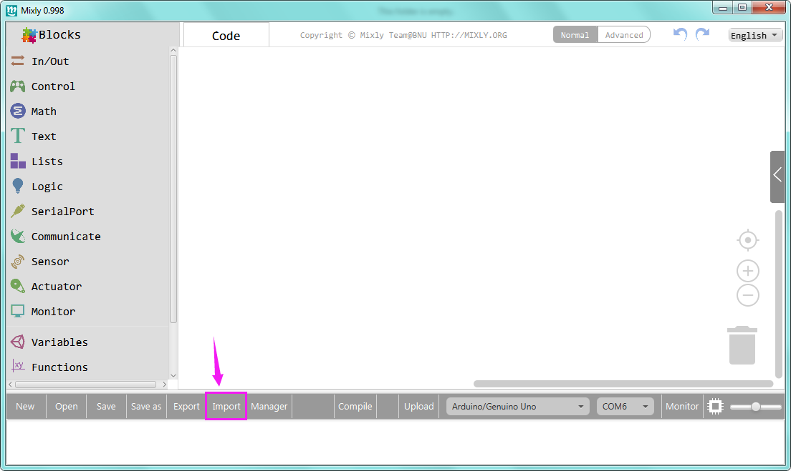

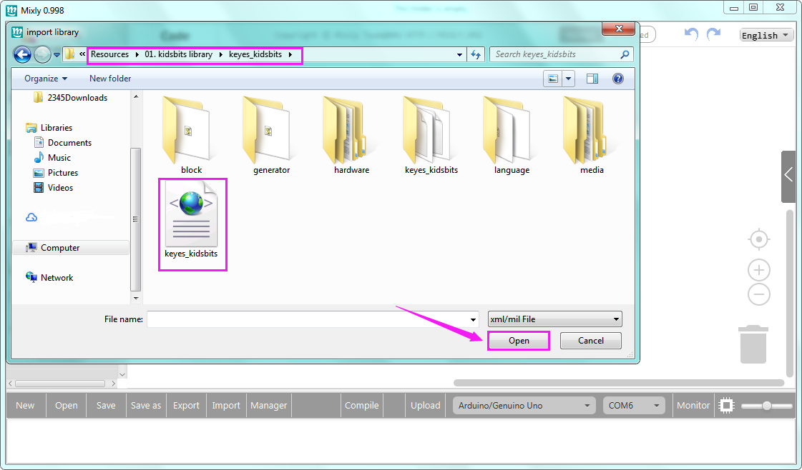

If import custom library successfully, you should see the sensor module library.

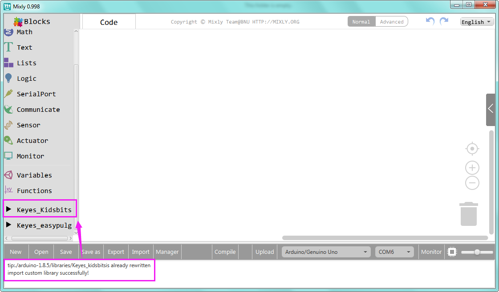

Click on the control output block of keyes_kidsbits, you can directly drag out
the corresponding module to use.

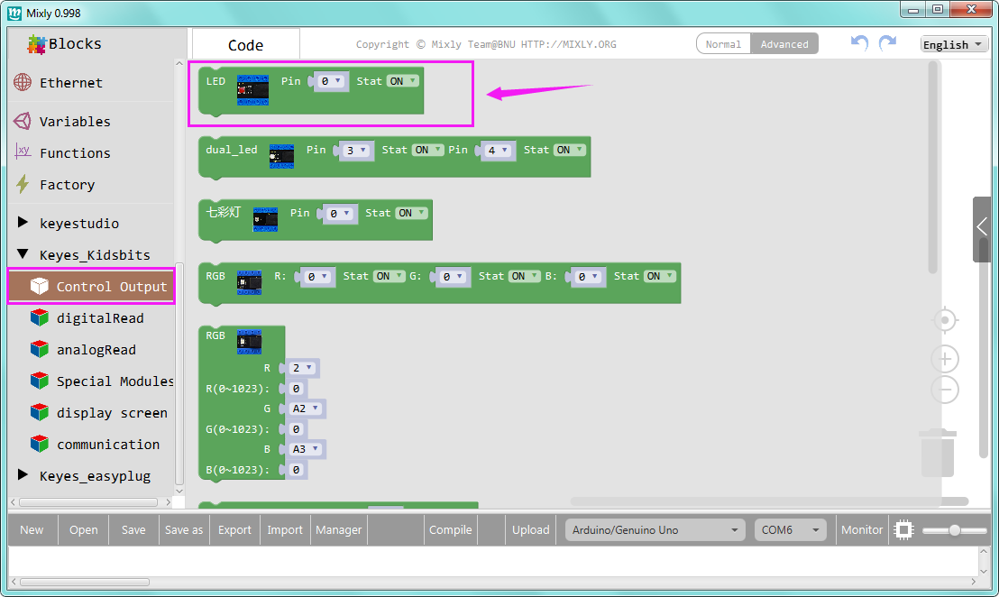

# Test Code

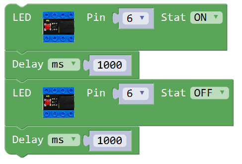

Open or directly drag the Mixly code of touch sensor to the Mixly window.

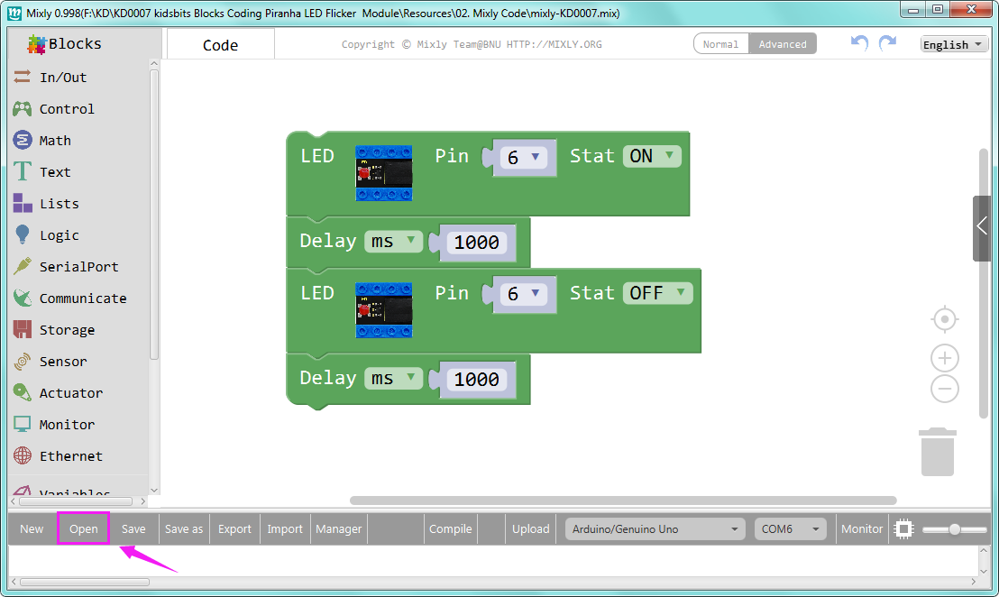

You can check the C language code on the right side :

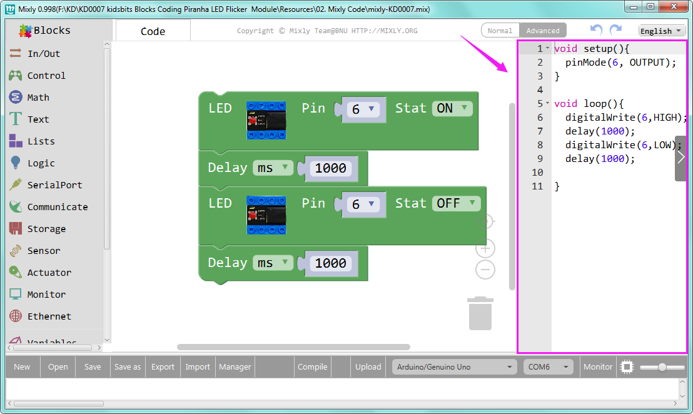

# Test Result

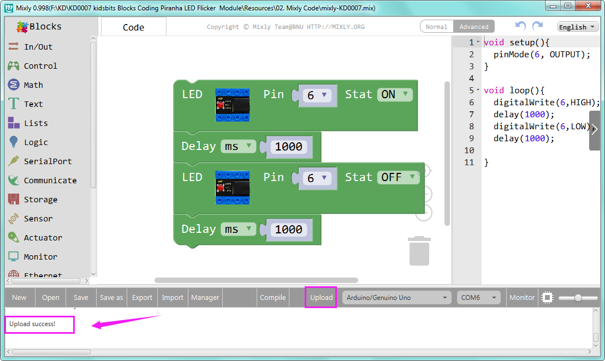

Hook it up and upload the code success, LED on the module flickers for one
second then off for one second, repeatedly and alternately.

# Resources Download

<https://drive.google.com/open?id=1RB-qlZ1gRYLeEcjSJ_I03j1SciI1A_Hk>

# 
